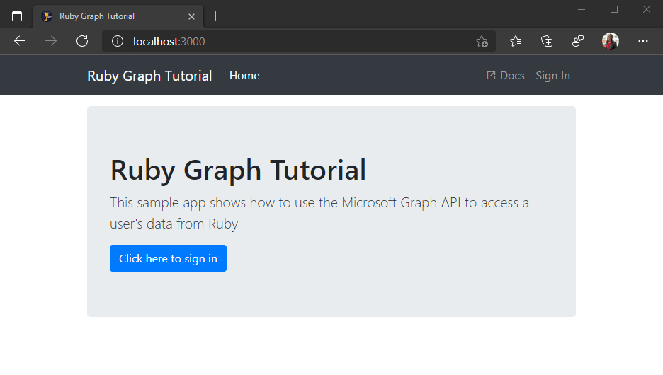

<!-- markdownlint-disable MD002 MD041 -->

Neste exercício, você usará o [Ruby on Rails](https://rubyonrails.org/) para compilar um aplicativo Web. Se você ainda não tiver os Rails instalados, você pode instalá-lo a partir da sua CLI (interface de linha de comando) com o seguinte comando.

```Shell
gem install rails
```

Abra sua CLI, navegue até um diretório no qual você tem direitos para criar arquivos e execute o seguinte comando para criar um novo aplicativo Rails.

```Shell
rails new graph-tutorial
```

O Rails cria um novo diretório chamado `graph-tutorial` e estruturará um aplicativo Rails. Navegue até este novo diretório e digite o seguinte comando para iniciar um servidor Web local.

```Shell
rails server
```

Abra o navegador e vá até `http://localhost:3000`. Se tudo estiver funcionando, você verá um "Yay! Você está nos trilhos! " Mensagem. Se você não vir essa mensagem, consulte o [Guia de introdução ao Rails](http://guides.rubyonrails.org/).

Antes de prosseguir, instale algumas Gems adicionais que serão usadas posteriormente:

- [omniauth-oauth2](https://github.com/omniauth/omniauth-oauth2) para manipulação de entrada e fluxos de token OAuth.
- [httparty](https://github.com/jnunemaker/httparty) para fazer chamadas para o Microsoft Graph.
- [nokogiri](https://github.com/sparklemotion/nokogiri) para processar corpos de email HTML.
- [ActiveRecord-session_store](https://github.com/rails/activerecord-session_store) para armazenar sessões no banco de dados.

Execute os seguintes comandos em sua CLI.

```Shell
bundle add omniauth-oauth2
bundle add httparty
bundle add nokogiri
bundle add activerecord-session_store
rails generate active_record:session_migration
```

O último comando gera uma saída como a seguinte:

```Shell
create  db/migrate/20180618172216_add_sessions_table.rb
```

Abra o arquivo que foi criado e localize a linha a seguir.

```ruby
class AddSessionsTable < ActiveRecord::Migration
```

Altere essa linha para o seguinte.

```ruby
class AddSessionsTable < ActiveRecord::Migration[5.2]
```

> [!NOTE]
> Isso pressupõe que você esteja usando Rails 5.2. x. Se você estiver usando uma versão diferente, substitua `5.2` pela sua versão.

Salve o arquivo e execute o comando a seguir.

```Shell
rake db:migrate
```

Por fim, configure Rails para usar o novo repositório de sessão. Crie um novo arquivo chamado `session_store.rb` no `./config/initializers` diretório e adicione o código a seguir.

```ruby
Rails.application.config.session_store :active_record_store, key: '_graph_app_session'
```

## <a name="design-the-app"></a>Projetar o aplicativo

Comece atualizando o layout global do aplicativo. Abra `./app/views/layouts/application.html.erb` e substitua seu conteúdo pelo seguinte.

```html
<!DOCTYPE html>
<html>
  <head>
    <title>Ruby Graph Tutorial</title>
    <%= csrf_meta_tags %>
    <%= csp_meta_tag %>

    <link rel="stylesheet" href="https://stackpath.bootstrapcdn.com/bootstrap/4.1.1/css/bootstrap.min.css"
      integrity="sha384-WskhaSGFgHYWDcbwN70/dfYBj47jz9qbsMId/iRN3ewGhXQFZCSftd1LZCfmhktB" crossorigin="anonymous">
    <link rel="stylesheet" href="https://use.fontawesome.com/releases/v5.1.0/css/all.css"
      integrity="sha384-lKuwvrZot6UHsBSfcMvOkWwlCMgc0TaWr+30HWe3a4ltaBwTZhyTEggF5tJv8tbt" crossorigin="anonymous">
    <script src="https://code.jquery.com/jquery-3.3.1.min.js"></script>
    <script src="https://cdnjs.cloudflare.com/ajax/libs/popper.js/1.14.3/umd/popper.min.js"
      integrity="sha384-ZMP7rVo3mIykV+2+9J3UJ46jBk0WLaUAdn689aCwoqbBJiSnjAK/l8WvCWPIPm49" crossorigin="anonymous"></script>
    <script src="https://stackpath.bootstrapcdn.com/bootstrap/4.1.1/js/bootstrap.min.js"
      integrity="sha384-smHYKdLADwkXOn1EmN1qk/HfnUcbVRZyYmZ4qpPea6sjB/pTJ0euyQp0Mk8ck+5T" crossorigin="anonymous"></script>
    <%= stylesheet_link_tag    'application', media: 'all', 'data-turbolinks-track': 'reload' %>
    <%= javascript_include_tag 'application', 'data-turbolinks-track': 'reload' %>
  </head>

  <body>
    <nav class="navbar navbar-expand-md navbar-dark fixed-top bg-dark">
      <div class="container">
        <%= link_to "Ruby Graph Tutorial", root_path, class: "navbar-brand" %>
        <button class="navbar-toggler" type="button" data-toggle="collapse" data-target="#navbarCollapse"
          aria-controls="navbarCollapse" aria-expanded="false" aria-label="Toggle navigation">
          <span class="navbar-toggler-icon"></span>
        </button>
        <div class="collapse navbar-collapse" id="navbarCollapse">
          <ul class="navbar-nav mr-auto">
            <li class="nav-item">
              <%= link_to "Home", root_path, class: "nav-link#{' active' if controller.controller_name == 'home'}" %>
            </li>
            <% if @user_name %>
              <li class="nav-item" data-turbolinks="false">
                <a class="nav-link" href="#">Calendar</a>
              </li>
            <% end %>
          </ul>
          <ul class="navbar-nav justify-content-end">
            <li class="nav-item">
              <a class="nav-link" href="https://developer.microsoft.com/graph/docs/concepts/overview" target="_blank">
                <i class="fas fa-external-link-alt mr-1"></i>Docs
              </a>
            </li>
            <% if @user_name %>
              <li class="nav-item dropdown">
                <a class="nav-link dropdown-toggle" data-toggle="dropdown" href="#" role="button" aria-haspopup="true" aria-expanded="false">
                  <% if @user_avatar %>
                     class="rounded-circle align-self-center mr-2" style="width: 32px;">
                  <% else %>
                    <i class="far fa-user-circle fa-lg rounded-circle align-self-center mr-2" style="width: 32px;"></i>
                  <% end %>
                </a>
                <div class="dropdown-menu dropdown-menu-right">
                  <h5 class="dropdown-item-text mb-0"><%= @user_name %></h5>
                  <p class="dropdown-item-text text-muted mb-0"><%= @user_email %></p>
                  <div class="dropdown-divider"></div>
                  <a href="#" class="dropdown-item">Sign Out</a>
                </div>
              </li>
            <% else %>
              <li class="nav-item">
                <a href="#" class="nav-link">Sign In</a>
              </li>
            <% end %>
          </ul>
        </div>
      </div>
    </nav>
    <main role="main" class="container">
      <% if @errors %>
        <% @errors.each do |error| %>
          <div class="alert alert-danger" role="alert">
            <p class="mb-3"><%= error[:message] %></p>
            <%if error[:debug] %>
              <pre class="alert-pre border bg-light p-2"><code><%= error[:debug] %></code></pre>
            <% end %>
          </div>
        <% end %>
      <% end %>
      <%= yield %>
    </main>
  </body>
</html>
```

Este código adiciona a [inicialização](http://getbootstrap.com/) para estilos simples e a [fonte incrível](https://fontawesome.com/) para alguns ícones simples. Também define um layout global com uma barra de navegação.

Agora, `./app/assets/stylesheets/application.css` abra e adicione o seguinte ao final do arquivo.

```css
body {
  padding-top: 4.5rem;
}

.alert-pre {
  word-wrap: break-word;
  word-break: break-all;
  white-space: pre-wrap;
}
```

Agora substitua a página padrão por uma nova. Gere um controlador de home page com o comando a seguir.

```Shell
rails generate controller Home index
```

Em seguida, `index` configure a ação `Home` no controlador como a página padrão para o aplicativo. Abra `./config/routes.rb` e substitua o conteúdo pelo seguinte

```ruby
Rails.application.routes.draw do
  get 'home/index'
  root 'home#index'

  # Add future routes here

end
```

Agora, abra `./app/view/home/index.html.erb` o arquivo e substitua seu conteúdo pelo seguinte.

```html
<div class="jumbotron">
  <h1>Ruby Graph Tutorial</h1>
  <p class="lead">This sample app shows how to use the Microsoft Graph API to access Outlook and OneDrive data from Ruby</p>
  <% if @user_name %>
    <h4>Welcome <%= @user_name %>!</h4>
    <p>Use the navigation bar at the top of the page to get started.</p>
  <% else %>
    <a href="#" class="btn btn-primary btn-large">Click here to sign in</a>
  <% end %>
</div>
```

Salve todas as suas alterações e reinicie o servidor. Agora, o aplicativo deve ser muito diferente.


