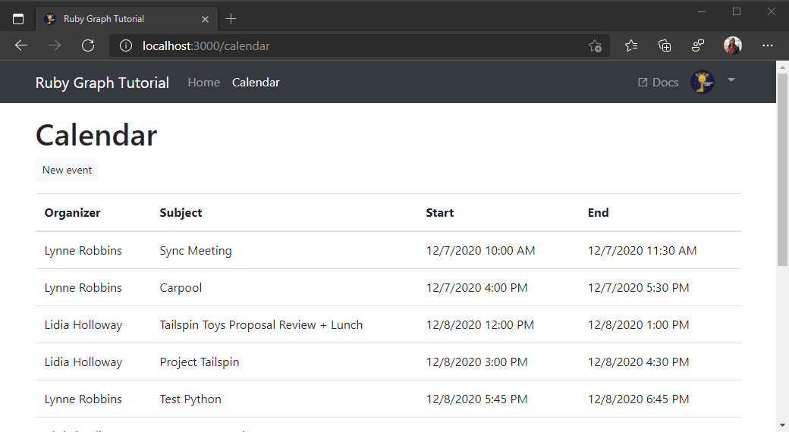

<!-- markdownlint-disable MD002 MD041 -->

Neste exercício, você incorporará o Microsoft Graph no aplicativo. Para este aplicativo, você usará o gem [httparty](https://github.com/jnunemaker/httparty) para fazer chamadas para o Microsoft Graph.

## <a name="create-a-graph-helper"></a>Criar um auxiliar de gráfico

1. Crie um auxiliar para gerenciar todas as suas chamadas de API. Execute o comando a seguir em sua CLI para gerar o auxiliar.

    ```Shell
    rails generate helper Graph
    ```

1. Abra **./app/helpers/graph_helper. rb** e substitua o conteúdo pelo seguinte.

    ```ruby
    require 'httparty'

    # Graph API helper methods
    module GraphHelper
      GRAPH_HOST = 'https://graph.microsoft.com'.freeze

      def make_api_call(method, endpoint, token, headers = nil, params = nil, payload = nil)
        headers ||= {}
        headers[:Authorization] = "Bearer #{token}"
        headers[:Accept] = 'application/json'

        params ||= {}

        case method.upcase
        when 'GET'
          HTTParty.get "#{GRAPH_HOST}#{endpoint}",
                       :headers => headers,
                       :query => params
        when 'POST'
          headers['Content-Type'] = 'application/json'
          HTTParty.post "#{GRAPH_HOST}#{endpoint}",
                        :headers => headers,
                        :query => params,
                        :body => payload ? payload.to_json : nil
        else
          raise "HTTP method #{method.upcase} not implemented"
        end
      end
    end
    ```

Reserve um tempo para revisar o que esse código faz. Ele faz uma solicitação GET ou POST simples através do `httparty` gem para o ponto de extremidade solicitado. Ele envia o token de acesso no `Authorization` cabeçalho e inclui os parâmetros de consulta que são passados.

Por exemplo, para usar o `make_api_call` método para fazer um get para `https://graph.microsoft.com/v1.0/me?$select=displayName` , você poderia chamá-lo da seguinte maneira:

```ruby
make_api_call 'GET', '/v1.0/me', access_token, { '$select': 'displayName' }
```

Você criará isso posteriormente à medida que implementar mais recursos do Microsoft Graph no aplicativo.

## <a name="get-calendar-events-from-outlook"></a>Obter eventos de calendário do Outlook

1. Na sua CLI, execute o seguinte comando para adicionar um novo controlador.

    ```Shell
    rails generate controller Calendar index new
    ```

1. Adicione a nova rota a **./config/routes.rb**.

    ```ruby
    get 'calendar', :to => 'calendar#index'
    ```

1. Adicione um novo método ao auxiliar de gráfico para [obter um modo de exibição de calendário](https://docs.microsoft.com/graph/api/calendar-list-calendarview?view=graph-rest-1.0). Open **./app/helpers/graph_helper. rb** e adicione o método a seguir ao `GraphHelper` módulo.

    :::code language="ruby" source="../demo/graph-tutorial/app/helpers/graph_helper.rb" id="GetCalendarSnippet":::

    Considere o que esse código está fazendo.

    - A URL que será chamada é `/v1.0/me/calendarview` .
        - O `Prefer: outlook.timezone` cabeçalho faz com que as horas de início e de término nos resultados sejam ajustadas para o fuso horário do usuário.
        - Os `startDateTime` `endDateTime` parâmetros e definem o início e o fim do modo de exibição.
        - O `$select` parâmetro limita os campos retornados para cada evento para apenas aqueles que o modo de exibição realmente usará.
        - O `$orderby` parâmetro classifica os resultados por hora de início.
        - O `$top` parâmetro limita os resultados a 50 eventos.
    - Para uma resposta bem-sucedida, ela retorna a matriz de itens contidos na `value` chave.

1. Adicione um novo método ao auxiliar de gráfico para pesquisar um [identificador de fuso horário da IANA](https://www.iana.org/time-zones) com base em um nome de fuso horário do Windows. Isso é necessário porque o Microsoft Graph pode retornar fusos horários como nomes de fuso horário do Windows e a classe **DateTime** do Ruby requer identificadores de fuso horário da IANA.

    :::code language="ruby" source="../demo/graph-tutorial/app/helpers/graph_helper.rb" id="ZoneMappingSnippet":::

1. Abra **./app/controllers/calendar_controller. rb** e substitua todo o seu conteúdo pelo seguinte.

    ```ruby
    # Calendar controller
    class CalendarController < ApplicationController
      include GraphHelper

      def index
        # Get the IANA identifier of the user's time zone
        time_zone = get_iana_from_windows(user_timezone)

        # Calculate the start and end of week in the user's time zone
        start_datetime = Date.today.beginning_of_week(:sunday).in_time_zone(time_zone).to_time
        end_datetime = start_datetime.advance(:days => 7)

        @events = get_calendar_view access_token, start_datetime, end_datetime, user_timezone || []
        render json: @events
      rescue RuntimeError => e
        @errors = [
          {
            :message => 'Microsoft Graph returned an error getting events.',
            :debug => e
          }
        ]
      end
    end
    ```

1. Reiniciar o servidor. Entre e clique no link **calendário** na barra de navegação. Se tudo funcionar, você deverá ver um despejo JSON de eventos no calendário do usuário.

## <a name="display-the-results"></a>Exibir os resultados

Agora você pode adicionar HTML para exibir os resultados de forma mais amigável.

1. Abra **./app/views/calendar/index.html. erb** e substitua seu conteúdo pelo seguinte.

    :::code language="html" source="../demo/graph-tutorial/app/views/calendar/index.html.erb" id="CalendarSnippet":::

    Isso executará um loop através de uma coleção de eventos e adicionará uma linha de tabela para cada um.

1. Remova a `render json: @events` linha da `index` ação em **./app/Controllers/calendar_controller. rb**.

1. Atualize a página e o aplicativo agora deve renderizar uma tabela de eventos.

    
