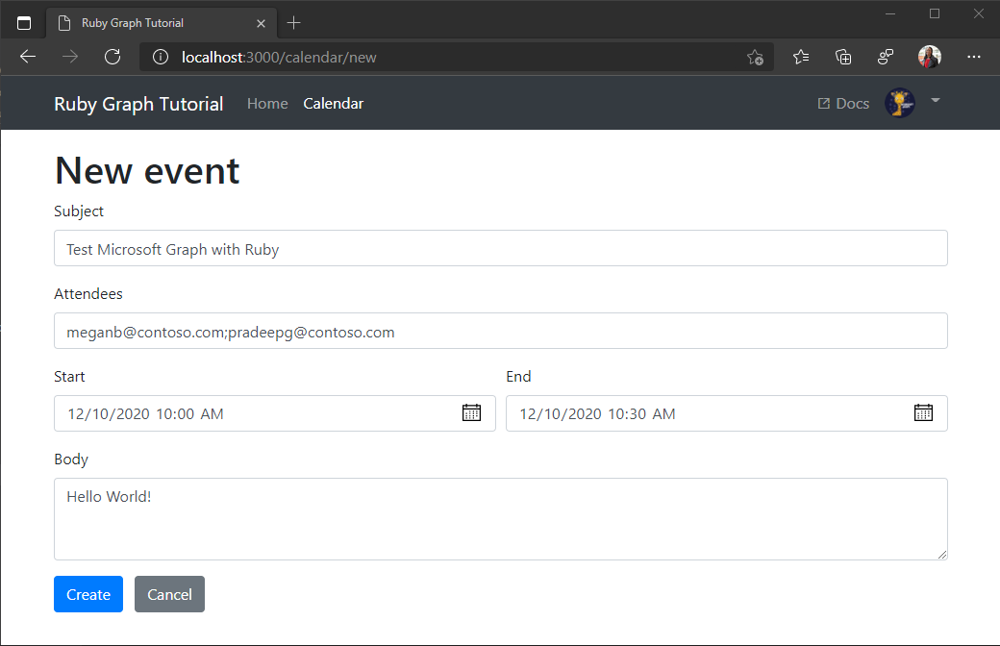

<!-- markdownlint-disable MD002 MD041 -->

Nesta seção, você adicionará a capacidade de criar eventos no calendário do usuário.

1. Open **./app/helpers/graph_helper. rb** e adicione o método a seguir à classe do **gráfico** .

    :::code language="ruby" source="../demo/graph-tutorial/app/helpers/graph_helper.rb" id="CreateEventSnippet":::

1. Abra **./app/controllers/calendar_controller** e adicione a rota a seguir à classe **CalendarController** .

    :::code language="ruby" source="../demo/graph-tutorial/app/controllers/calendar_controller.rb" id="CreateEventRouteSnippet":::

1. Abra **./config/routes.rb** e adicione a nova rota.

    ```ruby
    post 'calendar/new', :to => 'calendar#create'
    ```

1. Abra **./app/views/calendar/new.html. erb** e substitua seu conteúdo pelo seguinte.

    :::code language="html" source="../demo/graph-tutorial/app/views/calendar/new.html.erb" id="NewEventFormSnippet":::

1. Salve suas alterações e atualize o aplicativo. Na página **calendário** , selecione o botão **novo evento** . Preencha o formulário e selecione **criar** para criar um novo evento.

    
